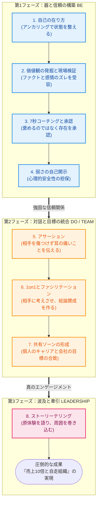
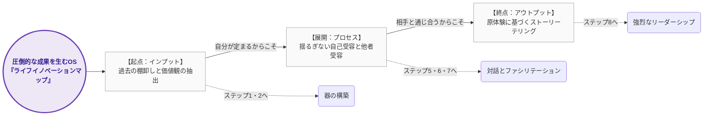
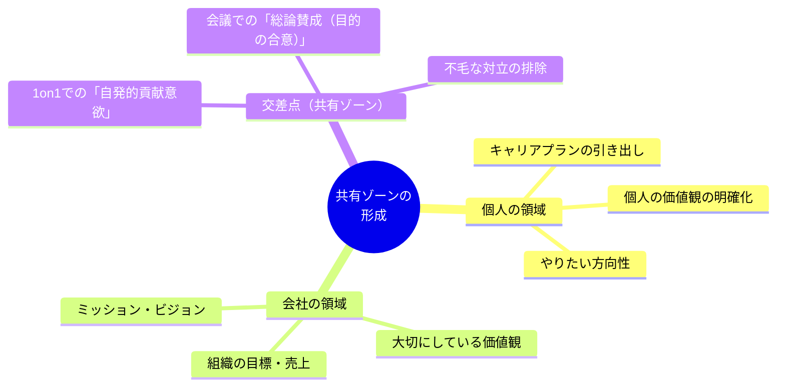

# MMS講義メソッド：インフォグラフィック・ドラフト（Mermaid版）

このファイルは、これまでに言語化したアキさんの「売上10倍の真髄（8ステップメソッド）」を視覚化するためのプロトタイプです。
文字化けを完全に防ぎ、後から文言をいくらでも修正できるように、テキストベースで図を描画できる「Mermaid（マーメイド）」という記法を使用しています。

## 1. カリキュラムの全体像（3つのフェーズと8ステップ）

---

## 2. ライフイノベーションマップが貫く「1つの軸 (OS)」

---

## 3. 「共有ゾーン」形成の詳細メカニズム（ズームアップ）

